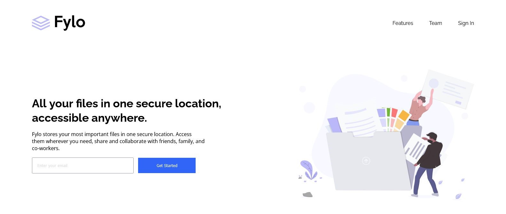

# Frontend Mentor - Fylo landing page with two column layout solution

This is a solution to the [Fylo landing page with two column layout challenge on Frontend Mentor](https://www.frontendmentor.io/challenges/fylo-landing-page-with-two-column-layout-5ca5ef041e82137ec91a50f5). Frontend Mentor challenges help you improve your coding skills by building realistic projects. 

## Table of contents

- [Overview](#overview)
  - [The challenge](#the-challenge)
  - [Screenshot](#screenshot)
  - [Links](#links)
- [My process](#my-process)
  - [Built with](#built-with)
  - [What I learned](#what-i-learned)
  - [Continued development](#continued-development)
- [Author](#author)

## Overview

### The challenge

Users should be able to:

- View the optimal layout for the site depending on their device's screen size
- See hover states for all interactive elements on the page

### Screenshot



### Links

- Solution URL: [Solution URL](https://github.com/sicktooth/fylo-landing-page-with-two-column-layout-master)
- Live Site URL: [Live site URL](https://sicktooth.github.io/fylo-landing-page-with-two-column-layout-master/)

## My process

### Built with

- Semantic HTML5 markup
- CSS custom properties
- Flexbox
- CSS Grid
- Desktop-first workflow
- [Styled Components](https://fonts.googleapis.com/) - For fonts
- [Styled Components](https://fontawesome.com/) - For icons

### What I learned

I learnt how to modify svg images, like the hover effect the width modification which is tricky and different from regular images.. width units used to make svg responsive is % while images are vw and %

To see how you can add code snippets, see below:

```css
.intro__image {
    width: 80%;
}
#main__footer {
    grid-template-areas: 
        'head head head head'
        'contact nav docs social'
    ;
}
```

### Continued development

I want to focus on more tricks in hover effects, svg images and javascript.

## Author

- Website - [Samuel Ogboru Osaronungwe](https://sicktooth.github.io/portfolio/)
- Frontend Mentor - [@sicktooth](https://www.frontendmentor.io/profile/sicktooth)
- Twitter - [@sammy_o_osaro](https://twitter.com/Sammy_O_Osaro)
